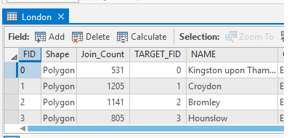

# ArcGIS Pro Snow

https://github.com/zarazaga/ArcGIS-Pro-Snow

Jessie Marshall Zarazaga - GIS@SMU - jzarazaga@smu.edu

*based on workshop by Stacey Maples, Geospatial Manager, stacemaples@stanford.edu Stanford Geospatial Center*

## Overview

Introduce basic vocabulary, concepts and techniques for working with spatial data in research. Introduce the interface / tools of ESRI ArcGIS Pro, desktop GIS software.  

## Setup

**Software** - 
Install the ArcGIS Pro software.

**Data**

Download the zip folder:  https://smu.box.com/v/IntroGISPro

Right-click on the *.zip and select Extract All.  Save on your DESKTOP.

Open the folder and look at the data: 
* **snow_map.png** - this is a non-georeferenced image of the map from John Snow’s original report on the cholera outbreak of 1854.

* **deathAddresses.csv**  - this is a table of latitude and longitude coordinates for addresses affected by the cholera outbreak. This table also contains the number of deaths at each address.  

* **London.shp** - a shapefile showing all the boroughs of the modern city of London.

* **Study_Area.shp** - A rectangular feature that describes our area of interest.  

#### Additional Files
an extra backup data folder that contains versions of files that we will create during the workshop.  


## Open the ‘Snow_map’ Image  


This is the famous map drawn by Dr John Snow, the founding father of modern epidemiology.  London suffered a series of cholera outbreaks during the mid-19th century, and Snow theorized that cholera was spread through contaminated water, rather than the prevailing theory of spread through "miasma" in the air.

London's water supply system consisted of shallow public wells where people could pump water to carry home; the sewage system of privies emptied into cesspools or cellars. The pervasive stench made the miasma theory very plausible. 

During the 1854 cholera outbreak Snow mapped the 13 public wells and all the known cholera deaths in the Soho district, near his home, and noted the spatial clustering of cases around the Broad Street water pump.  He had the pump handle removed from the Broad Street pump and the outbreak quickly subsided. Snow subsequently published a map of the epidemic to support his theory, showing the locations of the 13 wells and the addresses of the 578 cholera deaths, marked as stacked black bars.  
Our goal in this workshop is to explore the cholera outbreak of 1854 and determine whether there is evidence that the Broad Street pump is the source of the outbreak. We will map the locations and numbers of the cholera deaths, and compare them to the nearest water pumps.


### Create a Map Document

1. Create a new map document. Open ArcGIS Pro. Login with ArcGIS login.
2. Select “Start without a template.” A blank ArcGIS Pro interface opens.. 
3. Switch to the **Insert** Tab at the top of ArcGIS Pro. Click on the **New Map** button to add a basemap and create a view similar to that, below:


#### The Basic Components of the ArcGIS Pro Interface

The ArcGIS Pro interface is made up of three basic components:

**Ribbon** - Ribbon toolbar at the top which organizes tools into themes, such as Map and Analysis. **Get used to starting with the Ribbon.**

**The Data/Map Frame** – Map canvas where data visualizations appear.   

**The Table of Contents** - Where the “Layers” and datasets appear, as they are added to the map.   
 (Others tools appear on the Ribbon when their context is enabled.   eg. Click on a basemap layers to enable the ***Vector Tile Layer*** **Appearance** tab which allows you to set scale-dependent rendering and transparency.)

**Ribbon** - ArcGIS Pro uses a ribbon toolbar at the top of the interface which organizes tools into related themes, such as Map and Analysis. Other themes will appear when their context is enabled. For instance, clicking on one of the basemap layers enables the **Vector Tile Layer Appearance** tab, which provides for setting scale-dependent rendering and transparency.

  

### Add a GIS shapefile data layer

1.	Go back again to the **Insert** Tab at the top of ArcGIS Pro. Click on the **Add Folder** button, browse to the workshop folder **‘ArcGIS Pro JohnSnow’** but don’t open it. Press **OK.**
2.	In the Catalogue pane, click on the down arrow for **Folders > ArcGIS-Pro-JohnSnow > data > London_Borough.shp**, and drag that shapefile onto the map.

  

### Explore Navigation Tools and Visibility 
Most GIS navigation is quite familiar- using the mouse and mouse wheel.  Press to Pan, role to zoom. 
Look on the MAP tab, in the ‘Navigate’ set of tools, for the various ‘zoom options.  If you glide over each tool it will describe it.  They’re quite self-explanatory. Try them!

 

### Working with Layers 
#### Display Order  
The Layer Order in the **Contents** determines the order of display in your Map, when it is listed by 'Drawing Order Mode'.  (you can also display your Contents as 'List by Source')
Click and Drag the **London** layer to the bottom of **Contents**.  It has gone behind the basemap.  Drag it back!
#### ESRI 'Cloud' Basemap Data
As default with a new Map, ArcGIS Pro provides a pre-designed cartographic basemap to give your data geographic context.  You can turn this layer on or off, or change it.  
On the **Map** Tab, go to **Basemap**, and select **‘Light Grey Canvas’** or any alternative basemap.

 

### Feature Layer Tab
Most layer manipulation can be done under the **Feature Layer** tabs.  There are also short-cuts to do these tasks but the **Feature Layer** tab offers primary paths to work with layers.  
*(Note: almost every sub-command in Arc can be found 2 ways; as an icon on the feature tab, or by right-click and ‘properties’ in the contents for those familiar with ArcMap)*

Click onto the **London** layer.                   
The **Feature Layer** (orange) set of tabs appears at the top of the screen.  

There are 3 tabs:     ***Appearance, Labeling*** and ***Data***. 

***Appearace***: If you press **Symbology**, you can change all aspects of the appearance of your data. Change the color by pressing on the Symbol square in the right window. *(Or right click on the layer)*

***Labeling***: Press the option **‘Label’** The default Field shown will be Name, and all the Borough names will show on your map.

***Data*** tab; The second block has a button for the **‘attribute table’**.  Press it.  This is the data table from which this set of polygon shapes has been drawn. *(Or right-click on the layer in the contents window.)*

 

1.	Open the Attribute table:  **Feature Layer > Data > Attribute Table**  *(Shortcut: right-click on the  layer and slide down to Attribute Table)*

 

2.	You can sort fields by Ascending, scroll through the data, add additional fields to the table etc.

#### The Selection Tools
The Selection tools Provide ways to select features within a layer as well as by Attributes.  Test, then Clear selection.

 

#### Layer Visibility
The Table of Contents controls Layer Visibility using the checkbox next to each Layer.
 Use the **Visibility** Checkbox next to the **London** Layer to turn off the layer. 

 

#### Add another Data Layer

The **Area of Interest** defines our data-frame in this John Snow study. This will provide us with a convenient way to limit the processing extent of certain geo-processing tools.

1. In the Catalog panel drag and drag-and-drop the **Study_Area.shp** into the **Map.
2. Zoom into the small square *(you can also right-click to ‘zoom to Layer’)*
3. Make it into a square frame instead of a colored square: **Appearance > Symbology > properties > Color > no Color**   *(or right-click on the color patch in ‘Contents’ and select No color.)


### Save the project
There is no autosave.

### Create a data layer from an XY table

We want to add the points where deaths from Cholera happened. This set of data is a table, not a spatial data set. This table contains fields with the latitude and longitude coordinates of the deaths addresses we want to analyze.

1. Drag the ‘deathAddresses.csv file onto the contents window.
2.	On the **Map** Tab > click on **Add Data** > 
3. We want to **Add XY Point Data**. This will open the **‘Geoprocessing’** tools window, with the tool: **“XY Table to Point”**.  *(You can also find this through Analysis > Tools > search for ‘XY’)*. 


4. For **Output Feature Class**, check that the feature class will be exported to the default.gdb in your project folder. This ‘globaldatabase (gdb) is the default location for all new data you create, and is integrated into your map package file. It helps you keep track of your new data.
5. replace the default name with "**Deaths**"
6. The remaining settings should be as shown below: *(make sure the coordinate system is GCS_WGS_1984)*


7. Click **Run** and wait for the points to be added to the **Map** panel and the new layer to the **Contents**.


### Statistics on a field  

Take a peek at the data behind the Map. *(Make sure the layer is selected – framed in blue).* 

1. Open the Attribute table:  **Feature Layer > Data > Attribute Table**  *(Shortcut: right-click on the  layer and slide down to Attribute Table)*
2. The **Num_Cases** field in the Deaths layer indicates the number of deaths at each address. You can get a simple statistical snapshot of the variable from the Attribute Table.
3. Right-click on the header of the **Num_Cases** field and select **Statistics**
2. A histogram of the data distribution will appear over the top of the Attribute Table, and a "Distribution of Num_Cases" panel will appear in the tabbed panel area, on the right. 

   

### Layer symbology  
#### Proportional symbols on Deaths  

1. Different numbers of people died at each address.  Investigate the field: Num_Cases, by opening the attribute table: **Feature Layer > Data > Attribute Table** (*or right-click on the layer)*.
2. Open Symbology:  **Appearance > Symbology**.  *(Or right-click)*
2. Click the Drop-down to change the 'Single Symbol' to **Proportional Symbols** and set the Field=Num_Cases
3. In the **Histogram** the range of values for the Num_Cases is 1-18. Set the Minimum size = 1.00 and the Maximum size = 18, accordingly.
4. Click on the Template for the **symbol** and select Circle 3 (40%). Return to the Symbology panel by clicking on the back arrow.  


#### Setting a Reference Scale for Zooming

1. As you Zoom in and out of the Map/Frame the symbology remains the same size, regardless of the viewing scale.  We’d like to keep it proportional. Any changes that you want to make to the WHOLE map need to be made to the full map-frame. 
2. Right-click on the **Map** item at the top of the **Contents** and select **Properties**, to open the **Map Properties** dialog.
3. In the **General** table, change the **Reference scale** option to 1:5000. Click OK to apply the setting.
4. Zoom in and out to see that the symbols now change size along with the map. 


####Spatial Bookmarks

To move around the map and then efficiently return to our primary area of interest, it is often useful to create a spatial bookmark.
1.	Right-click on the study_area layer and Zoom to layer.
2.	On the **Map Tab > Bookmarks  > New Bookmark**.  Name it **“SOHO”**
3.	Click on the **Full Extent** button to zoom to the world, then use the **Map > Bookmarks > Soho** to return.


## Creating New Spatial Data

### Georeference a map  

Our goal in this workshop is to explore the cholera outbreak of 1854 and determine whether there is evidence that the Broad Street pump is the source of the outbreak. To do this we want to spatially allocate all of the death addresses in our data set to the water pump that they are nearest. Often the data that we need for our analysis doesn't exist in the format that we need it in. In this section we will use John Snow's original map of the 1854 cholera outbreak as a source for the locations of the water pumps in our analysis. 

1. From the data folder and drag-and-drop the **snow_map.png** image into the **Map** of your project. 
2. Click Yes if you are prompted to "Build pyramids". *(if it doesn’t prompt, you can right-click on the layer)*

3. Note that the layer is added to the  **Contents**, but doesn't yet appear in the Map.
4. Click on the **snow_map.png** Layer to select it and then click on the **Imagery** tab (to activate the **Imagery tools**). Click on the **> Georeference** icon to open the **Georeferencing** Tool bar and start georeferencing.  
  
5. Right-click and "Zoom to..." the **snow_map.png**, then use the mouse scroll button to zoom to the upper left corner of the image, where the **Regent Circus** can be found.
6. Click on the **Add Control Points** tool and then place a Control Point Link at the center of Regent Circus.  
  
7. Right-click and "Zoom to..." the **Study_Area** layer. Use the mouse scroll wheel to zoom into the same area of Regent Circus, and place the second GCP link at that location. Note that the map image will automatically "snap" these two GCP links together. *(If it remains invisible, save and close georeferencing, then re-open. This just happens sometimes)* 
  
8. Use the scroll wheel to zoom out and then into the bottom right corner of the **snow_map.png** layer to find the Intersection of **Oxendon Street & Coventry Street**. Add a Ground Control Point link to the Southeast corner of the intersection.
9. Toggle off the visibility of the **snow_map.png** and **right-click>Zoom to...** the **Study_Area** layer. 
10. Locate the corresponding intersection in the now visible basemap and place the second link of the Control Point. 
11. Toggle the visibility of the **snow_map.png** layer to see that it has "snapped" these two links together, as before. 
12. Locate and place 3 more **Ground Control Points** (1 in each remaining corner and one near the center).  

13. If you make a mistake, you can show the control point table, turn off each point one-by-one to see which one is faulty, and then select and delete that point. 
14. Click on the **Save** button of the **Georeference** toolbar, then click on the **Close Georeference** button. 
15. Browse to the **data** folder using your Windows File Explorer and note that new files have been added to the folder. They include **snow_map.png.pgwx**, which is the "World File" for the image you just georeferenced. As long as this file sits next to the **snow_map.png** file, GIS applications, such as Google Earth Desktop, ArcGIS, QGIS, etc... should now be able to colocate this image with other datasets.  

 
### Digitize features from a georeferenced map

If the last section didn't go well, add the ```John_Snow_Map.tif``` from the **/backup_data/**  

Now we would like to digitize the locations of the **Water Pumps** in the neighborhood, from the **john_snow.png**. To do this, we first need to create and  "empty" Feature Layer in our default.gdb for the project we are working on. 

1. Return to the Catalog panel and browse to **Databases**, right-click on the **Default.gdb** and go to **New>Feature Class** to begin the New Feature Class dialog.  
  
2. In the resulting dialog, use these settings: **Name:** pumps; **Alias:** Water Pumps; **Feature Class Type:** Point. Click **Next**.  
  
3. Add a Field: **Field Name:** Label; **Data Type:** Text. Click **Next**.  
  
4. Set the **Spatial Reference** to **GCS WGS 1984**. Click **Finish**. 
   


### Add points to your Feature Class

  

1. Drag-and-Drop the new **pumps** Feature Class into your Map Frame. Note that the layer is added to the Table of Contents, using the alias: **Water Pumps**. 
2. With the **Water Pumps** layer selected in the Table of Contents, Click on the **Edit** Tab, at the top of ArcGIS Pro, to activate the **Edit** tools ribbon.   
3. Click on the **Water Pumps** layer and open the **Attribute Table.  > Feature Layer > Data > Attribute Table** *(or right-click)*. 
4. Click on the **Create** tool button, and note that a set of templates for each of your vector data layers will appear in as a panel on the right.  
  
5. Click on the **Water Pumps** template, in the **Create Features** panel on the right, to select the Water Pump point.  
6. Locate a Water Pump in the **snow_map.png** layer and click on it to place the point. 
7. In the Attribute Table, below, double-click on the new record, under the **Label** field and enter a value for the Label field (we will use the name of the nearest street), and hit **RETURN**.
8. Repeat for the remaining 12 water pumps in the Snow Map. (13 pumps in all; some right near the edge.)  
  
9. Click the **Save** button and confirm to save your edits.  Close the **Create Features** Panel to close the edit session.
Close the Water Pumps Attribute Table.
 Zoom to the Water Pumps.
12. Toggle off the visibility of the **snow_map.png** layer.  
  


### Finding an already georeferenced map from DavidRumsey.com

There are many venues for searching for old maps as sources for spatial data and I've listed a few below. Of course, there are many considerations of scale, authority, projections, etc.when using a scanned map as a data source, it is possible to scan and georeference just about any map you can find reference data (another map to georeference to) for.

* [earthworks.stanford.edu](earthworks.stanford.edu)
* [DavidRumsey.com](DavidRumsey.com)
* [OldMapsOnline.com](OldMapsOnline.com)

We'll start by looking at this map [[Gegend von London 1853](https://www.davidrumsey.com/luna/servlet/detail/RUMSEY~8~1~298861~90066747:Gegend-von-London-1853?sort=Pub_List_No_InitialSort%2CPub_Date%2CPub_List_No%2CSeries_No&qvq=w4s:/where%2FLondon%2B%252528England%252529%2Fwhen%2F1854;q:london%201854;sort:Pub_List_No_InitialSort%2CPub_Date%2CPub_List_No%2CSeries_No;lc:RUMSEY~8~1&mi=1&trs=2)] of London on [https://davidrumsey.com](https://davidrumsey.com). It already has a "**Georeferenced** version, which can be viewed by clicking on the **Georeferencer** button at the top of the page.


David Rumsey makes Open Geospatial Consortium (OGC) compliant services available for  georeferenced maps on his site. This means that you can use the maps directly in most modern GIS applications, including ArcGIS Pro, QGIS, ArcGIS Online, etc.

### Adding a DavidRumsey.com WMTS map Service to ArcGIS Pro

YOu have to sign into the goreferencer, and look for the WMTS link. 


To save a step, hHere is the **Web Map Tile Service WMTS URL** for the Gegend map:  

```http
https://maps.georeferencer.com/georeferences/28da2318-c4b3-5f25-83dc-3da27859fea2/2019-02-19T17:27:12.514288Z/wmts?key=mpIMvCWIYHCcIzNaqUSo&SERVICE=WMTS&REQUEST=GetCapabilities
```
 
This URL provides access to the georeferenced map outside of the DavidRumsey.com website.

To insert this map into ArcGIS Pro, on the **Insert** tab, in the **Project** group, click the **Connections** icon drop-down list and click **New WMTS Server**. The **Add WMTS Server Connection** dialog box appears. Type the URL of the WTMS server site.
IN the catalog paine, the maps.georeferencer shows up under the folder **Servers**. Expland the down arrow, and drag the map **Gerend von London** onto the **map** page. It will take a while to load. 

## Basic spatial data analysis (Using Geoprocessing Tools in ArcGIS Pro)

At the top of ArcGIS Pro, click on the **Analysis** tab.  Some of the most common tools appear in the icons in the **tools** box on the right.  To see the full set of tools, click on the **Tools** button, which will open the **Geoprocessing** panel at the right.  Clicking on **Toolboxes** will show you ALL the tools. 

### Buffer
1.	To see how many deaths occured near each pump we will start with a simple analysis. Lets see if it's useful to know how many died within a 100 meter buffer around each pump.


2. Use	**Analysis > Tools Box**, click on **Buffer** and the geoprocessing panel opens.
Input: **pumps**
Output: pumps_Buffer (this is the default)
Distance : **100  Meters**    and click **Run**.

We can see some of the buffers contain many deaths, and others contain fewer. (It still doesn’t look very clear). We now decide to Count the number of cases within each buffer.   

### Summarize within 
See how many homes with deaths are within each polygons. 
1.	**Analysis > Tools button** to open the Geoprocessing Panel
2.	In the **Find Tools Search Box**, search for **“summarize” > summarize within**.
Input: **pumps_buffer**, and the features from the **deaths** layer
Sumary Fields: **Num_cases: Sum** (we want to add all the cases within each buffer ring)   and click **Run**.


Open the Attribute table.
Each buffer ring has a different number of cases.


Illustrate the difference in quantity within each buffer by color: in **symbology** use Graduated colors. 


Try different **Distribution** methods to test what this reveals about the data. 


We see that, after all, this wasn’t very useful representation. Let’s try a new way of finding out which addresses are connected to which pump. Buffers are not very useful because there are There are lots of points outside the buffers. Where did those people get their water?  Which is their closest pump?  We will test another tool.

### Voronoi (Thiessen) polygon (Spatial Allocation)

Thiessen polygons allocate space in an area of interest to a single feature per polygon. That is, within a Thiessen polygon, all features are closer to the point that was used to generate that polygon than to any other point in the feature set. In this case, we will create a set of Thiessen polygons based upon the locations of the **Water Pumps** in our project. This will allow us to easily allocate all of the points in our death addresses dataset to the water pump that they are nearest using a simple spatial join.

1. Again click on the **Analysis tab > Tools button** to open the **Geoprocessing** panel. 
2. Use the **Find Tools** box to search for **Voronoi** and click on the **Create Thiessen Polygons** tool.
4. Set the options as: Input Features:**Water Pumps**; Output Feature Class: **Voronoi**; Output Fields: **All fields**.  
  
5. We want to ensure we include the whole map area, even that beyond the last pump. Click on the **Environments** tab and set the Extent: **Same as:Study_Area**; and click **Run**.  
6. The result will be (as shown below) a layer of polygons that define the area closest to the water pumps that generated them.   
  
7. Right-click on the new Voronoi layer and Open the Attribute table. Note that it contains the fields from the **Water Pumps**, including the **Label** field.  Make the lables visible: **Feature Layer > Labeling Tab > Label **(field is Label)

### Summarize within again
Now that you have created the Voronoi polygon layer we can again try using **Summarize within** to see how many homes are within each polygon.
**Analysis > Tools > Geoprocessing Panel > summarize within**.
Input: **Voronoi**, and the features from the **deaths** layer
Summary Fields: **Num_cases: Sum** (we want to add all the cases within each polygon)  and **Run**.
Look at the **Attribute Table**. 
We see the total cases connected to each pump.  Clearly the Broad street pump is culpable.  

### Spatial Join (Point Aggregation)
But we also want to know, for each individual death, which pump is attributed (or closest) to that address.  This will allow greater statistical understanding. To “allocate” each address to one of the Voronoi polygons we have a better tool.  We will use a **Spatial Join** so that for each **death address** point, the vernoi polygon’s attribute (pump name) is also connected to it. 

1. We can do: **Analysis > Tools >Spatial Join** to open the **Spatial Join** Geoprocessing tool. 
(*Or try Right-click on the Deaths layer and go to Joins and Relates>Spatial Join.   If the tool is opened from the Deaths layer, the Target Features: are already set.)* 
2. Use **Voronoi** as the **Join Features** and change the **Output Feature Class** to **Deaths_Allocated**. The remaining default settings should appropriate.  
  
3. A new layer, called **Deaths_Allocated** will be added to the **Table of Contents**. Open the **Attribute Table** to confirm that each record now has the "**Label**" for the the nearest **Water Pump**.  (to open: **Feature Layer > data > Attribute Table**, or right-click on the **Deaths_Allocated** layer)
  

### Summary Statistics

Finally, we would like to summarize the deaths in the outbreak, grouping our summary by the name of the Water Pump that each Death Address is nearest. We will do this using the **Summary Statistics Tool** which allows us to do a statistical summary similar to the one we did earlier on the entire data set, but this time grouped by nearest water pump.

1. With the **Deaths_Allocated Attribute Table** still open, right-click on the header for the **Num_Cases** column and select **Summarize** to open the **Summary Statistics** Geoprocessing tool.
2. Use the drop-downs to set the Statistics Fields as shown, below:  
  
3. Set the **Case field** to the **Label** column, in order to group the summary by nearest **Water Pump**, and click **Run**.
4. Right-click the resulting **Deaths_Allocated_Statistics** table and Open it. Right-click on the **SUM_Num_Cases** field header and select **Sort Descending**  
  

## Basic Measures of Spatial Central Tendency

### Spatial Mean (Mean Center)

The Mean Center is defined by the average x- and y-coordinate of all the features in the study area. It's useful for tracking changes in the distribution or for comparing the distributions of different types of features. Here, we will use the Mean Center to highlight the distribution of deaths around the Broad Street Pump.  

First, we will calculate a simple spatial mean. This is simply the mean center of the **distribution of locations** 

1. CUse the **Analysis > Tools** button to open the **Geoprocessing Panel**
2. In the *Find Tools* Search Box, search for **Mean Center** geoprocessing script.
4. Use **Deaths_Allocated** as the Input Feature Class, and give the Output Feature Class a meaningful name. **Run**.

The new Layer added to your Map has a single feature: the *Spatial Mean* of the distribution of *addresses* at which deaths took place. That is, we have determined the *Spatial Mean of the effected addresses*, however it is not the Spatial Mean of all of the deaths in the neighborhood, since some addresses had many. 


### Weighted Spatial Mean
We will use the Num_Cases field to calculate the *Spatial Mean* of all deaths in the outbreak, by calculating a **Weighted Spatial Mean**
1. **Run** the **Mean Center tool** again, this time assigning the **Num_Cases** field as the **Weight Field**. Rename the **Output Feature Class** by adding a "W" to the end of the filename.
2. Click on the color patch for the resulting layer to select a color that contrasts with that of the previous, unweighted Mean. 

Note that, while the change is slight in this relatively small and uniform distribution of points, there is a noticeably movement of the **Weighted Spatial Mean** towards the Broad Street Pump. 


#### Cased Spatial Mean 
Run the Weighted Spatial Mean again, this time setting the **Case Field** option to the "**Label**" field and observe the results. This has the effect of "casing" the spatial mean, based upon the spatial allocation that we did earlier.


### Standard Distance

The **Standard Distance** is the spatial statistics equivalent of the standard deviation. It describes the radius around the spatial mean (or weighted spatial mean), which contains 68% of locations in your dataset. It can be very useful for working with GPS data.

1. On the Geoprocessing Tab, and click the **Back Arrow** to return to the **Search Results**. 
2. Search for "**Standard Distance**" and click on teh resulting **Standard Distance script tool**
3. Use **Deaths_Allocated** as the **Input Feature Class**
4. Add a "**1**" to the end of the name of the **Output Standard Distance Feature Class** and confirm that the **Circle Size** is set to **1 standard deviation**
5. Use **Num_Cases** as the **Weight Field** and click **Run**.


The resulting Standard Distance circle, is not a circle. This is because we used unprojected data (using long.and lat. degrees) for the calculation, which geoprocessing tools that measure distance and area often have trouble with. If you look to the bottom of the Geoprocessing panel, you will notice that the **Standard Distance completed with warnings** and that hovering your mouse reveals more information about the error, including a clickable link.  


### Export your deaths data with a new projection

We will export our **Deaths_Allocated** dataset to a new projected version (flattened to use meters), translating it to a Projected Coordinate System that is appropriate for measuring distance at the scale of our project. 

1. Make sure the layer is Selected.  Go to the **Feature Layer > Data Tab >** and click on **Export Features**  *(or right-click on the Deaths_Allocated layer and Data>Export Features)* 
2. Name the **Output Feature Class** **Deaths_Allocated_UTM** 
3. Click on the **Environments Tab**, at the top of the Geoprocessing Panel. 
4. Click on the **Globe icon** at the right of the drop-down and expand the Layers section. (these are different projections of the different layers in your map).
5. Select the **WGS 1984 UTM Zone 30N** projection and click **OK**.
6. Click **Run** to export the new Feature Class

Return to the **Standard Distance** Tool and run it again, this time using your **Deaths_Allocated_UTM** as the **Input Feature Class**


The result should be a circle, whose diameter encompasses 68% of the **Deaths** in our dataset.

#### Bonus:  
Run the **Standard Distance** again, this time without a **Weight** field and observe the results. Now you are calculating the Standard Distance based upon the **LOCATIONS**. What effect has that had on the Standard Distance? Why?


### Creating a surface from Point Data to Highlight “Hotspots”

Hotspot mapping is a popular technique for quickly identifying spatial structures in your data. You have the software "interpolate" or guess the values of the entire study area, based upon the discrete samples of each pump that our **Deaths_Allocated** points represent. 

#### Kernel Density

The Kernel Density Tool calculates a magnitude per unit area from the point features using a kernel function to fit a smoothly tapered surface to each point. The result is a raster dataset which can reveal “hotspots” in the array of point data.

1. Toggle off the visibility of all but your **Water Pumps** layer
2. Return to the Geoprocessing Panel and **Search** for "**Kernel Density**", then click to launch the tool
3. Use the following settings, and click **Run**:  

|              Setting: | Value                  |
|----------------------:|------------------------|
| Input point features: | Deaths\_Allocated\_UTM |
|     Population field: | Num_Cases              |
|        Output raster: | DeathTopo              |
|     Output cell size: | 1                      |
|        Search radius: | 50                     |
|           Area units: | Square kilometers      |
|   Output cell values: | Densities              |
|               Method: | PLANAR                 |  

Note that the "Hottest" spot on the resulting map lies directly beneath the **Broad Street Pump**


 
## Creating a Basic Map Layout (in process)


### Add a Layout & Data Frame

1. Save your work if you haven't in a while.
2. On the Insert Tab, at top of ArcGIS Pro, Click on the **New Layout** button and select **ANSI - Landscape> Letter** to add a new layout to your ArcGIS Pro Project.
3. On the Insert Tab, again, click the **Map Frame** tool, select your John Snow map from the top row. 
4. Drag a squar(ish) box that fills the page as much as possible to place the Data Frame on the page.

### Activate the Map

In order to edit and adjust the map view, you need to activate the map in your layout, so that navigation and other tools are applied **WITHIN** the **Data Frame**, rather than on the **Layout Page**, itself.

1. Click on the **Layout Tab**, then click on the **Activate** button, to make your Data Frame active.
2. Use your mouse and scroll wheel to zoom into the central part of the map so the the edges of the Voronoi layer don't display. Alternatively, you can Right-Click on the **DeathTopo** layer and **Zoom to layer**
3. Toggle on and off your layers until the following are toggled on and visible, in the following order:  

 * **Deaths\_Allocated\_Mean\_CenterW**
 * **Water Pumps**
 * **Deaths\-Allocated\_UTM**
 * **Voronoi**
 * **Light Gray Base**

4. Use Ctrl-clicks to select these layers and then right-click>Group them. Rename the Group "In Map"
5. Remove the remaining layers by Ctrl-click selecting and right-click>Remove.

### Add an SVG Symbol
https://publicdomainvectors.org/en/free-clipart/Vector-drawing-of-water-pollution/6505.html

1. With the Map Frame still activated, Select the **Deaths\_Allocated\_Mean\_CenterW** layer and Click on the Appearance Tab
2. Click on the **Symbology** button to open the Symbology Panel.
3. In the Symbology Panel, click on the current **Symbol** point to open it's properties.
4. Change to the **Properties** Tab, then click on the **Layers** button to begin importing a new symbol.  

5. Click on the **File...** button, browse to your **/data/** folder and select the **frackingwater.svg** and click **OK** to open it. 
6. Set the **Size** to 48pt
7. Change teh Color to Blue
8. Change the **Element** target to the water drop (you may have to scroll down to see it), then change its color to **Yellow**.
9. Click **Apply** to commit the changes.


### Add & Format Text and Graphics  
http://saganipsum.com/

### Add & Format a Legend

### Add Scale

### Add Neatline

### Add Text

### Print to PNG


